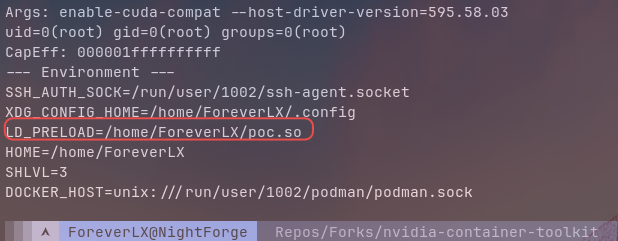

# security-research

**Azrael Security — Offensive Security Research**

Published by [ForeverLX](https://github.com/ForeverLX) | Azrael Security™

[](https://github.com/CR1MS0N-Operator/security-research)
[](https://nvd.nist.gov/vuln/detail/CVE-2025-23266)
[](research/container-boundaries/README.md)

> This repository documents original offensive security research, adversary emulation technique development, and infrastructure-focused vulnerability analysis produced by Azrael Security. Work is conducted exclusively on authorized, self-operated infrastructure. All findings are mapped to MITRE ATT&CK where applicable.

**Flagship publication:** [_Below the Abstraction: Hook Isolation Failures in the NVIDIA Container Toolkit_](research/container-boundaries/README.md) — the CVE-2024-0132 → CVE-2025-23359 → CVE-2025-23266 chain analyzed under rootless/rootful Podman across the runc and crun OCI runtimes. Repository contents: one research whitepaper, two reverse-engineering technique writeups (`re-1`, `re-2`), and supporting documentation.

---

## Documentation

| Document | Purpose |
|---|---|
| [ARCHITECTURE.md](ARCHITECTURE.md) | Research structure, writeup format, content categories |
| [CONTRIBUTING.md](CONTRIBUTING.md) | How to add research; review process |
| [SECURITY.md](SECURITY.md) | Engagement boundary, redaction policy, what never goes public |
| [CHANGELOG.md](CHANGELOG.md) | Release history from git |
| [AGENTS.md](AGENTS.md) | Commands and conventions for AI agents |
| [docs/CONTENT-INVENTORY.md](docs/CONTENT-INVENTORY.md) | Full inventory: writeups, CVEs, techniques, diagrams, code samples |
| [docs/MIGRATION.md](docs/MIGRATION.md) | azraelsec.dev migration status |

---

## Research Methodology

All research in this repository follows a systematic five-phase methodology designed to produce reproducible, defensible findings suitable for technical publication and operational adoption.

**Phase 1: Baseline Establishment**
Document the expected isolation behavior per component under test. For container boundaries, this means establishing what the runtime specification claims about namespace isolation, filesystem access, and process visibility. For kernel research, this means characterizing the intended behavior of syscall interfaces, capability boundaries, and privilege separation mechanisms. Baseline is derived from specification documentation, source code audit, and empirical measurement.

**Phase 2: Boundary Identification**
Identify the exact mechanism — syscall, kernel feature, configuration parameter, or runtime behavior — that enforces the control under examination. This phase answers the question: what is the specific enforcement point that prevents an operation from crossing the boundary? Traceability to source code or kernel interface is required.

**Phase 3: Deviation Testing**
Construct minimal reproduction cases that probe the boundary for unexpected behavior. Each test targets a single variable (namespace type, runtime flag, kernel version, hook configuration) while holding all others constant. Tests are designed to falsify the baseline assumption, not confirm it. A positive result (boundary violation) is required for publication; negative results are documented as scoped findings.

**Phase 4: Impact Mapping**
Connect each finding to a real operational context. For container boundary research, this means identifying the deployment patterns (agentic AI workloads, red team C2 infrastructure, multi-tenant GPU environments) where the finding represents a practical attack surface. Impact is assessed in terms of privilege escalation path, information disclosure scope, and exploitation prerequisites.

**Phase 5: Documentation**
Write up findings in a structured format suitable for a technical audience. Every documented finding includes: root cause analysis, reproduction steps, affected configurations, detection guidance, and MITRE ATT&CK mapping where applicable. Writeups are not CTF walkthroughs; they are analytical artifacts that explain why a vulnerability exists, not just how to trigger it.

> This methodology is applied consistently across all research areas. Deviations are noted per finding.

---

## Active Research Areas

| Area | Status | Last Activity | Priority |
|---|---|---|---|
| Container Boundary Research | **Active — flagship** | 2026-04-12 (Whitepaper 1 shipped) | Q2 sustaining |
| Linux Kernel & Systems Research | **Active — early stage** | 2026-Q1 | Building toward |
| Reverse Engineering | **Active — challenge series** | Ongoing | Q2 sustaining |
| Active Directory Attack Paths | **Active — course-integrated** | Ongoing | Q2 sustaining |
| Red Team Infrastructure Research | **Active** | Ongoing | Q2 sustaining |

---

### 1. Container Boundary Research
**Status:** 🟢 Active — Flagship Q2 research track
**Lead platform:** Cerberus (Podman rootless, Arch Linux)
**Secondary platform:** Tairn (Docker, NixOS 24.11)

Investigating Linux container isolation boundaries as they apply to real offensive infrastructure and, increasingly, to GPU-enabled multi-tenant AI workloads. Focus areas:

- **Filesystem and mount abuse** — overlayfs behavior, bind mount escapes, volume permission misconfigurations in rootless Podman and Docker contexts
- **Namespace privilege boundaries** — user namespace privilege mapping, PID/mount namespace isolation failures, capability leakage across namespace transitions
- **Process visibility leaks** — `/proc` exposure from within containers, cross-container PID visibility under different namespace configurations
- **Infrastructure applicability** — how these primitives map to real red team infrastructure (C2 isolation, agent staging environments, container-based implant delivery)
- **CVE-2025-23266 & the NVIDIA hook execution surface** — environment inheritance from container images into host-privileged `createContainer` hooks via the OCI runtime; four-way comparison (rootless/rootful Podman × runc/crun) demonstrating runtime-specific reachability of the exploitation path
- **GPU multi-tenant threat model** — compromised agentic workloads in GPU-enabled containers accessing NVIDIA's hook execution boundary; CDI spec generation, `LD_PRELOAD` injection into host hook processes, and the architectural gap between patch-level fixes and root-cause corrections in `libnvidia-container` / `nvidia-container-toolkit`

Research platforms: Cerberus (rootless Podman, Arch Linux), Tairn (Docker, NixOS 24.11), and NightForge (Arch Linux — host of the Whitepaper 1 lab environment, [§5](research/container-boundaries/README.md#section-5-open-research--rootless-podman--runc)) — live infrastructure, not synthetic lab VMs.

<!--  -->
<!--  -->

---

### 2. Linux Kernel & Systems Research
**Status:** 🟡 Active — early stage, building toward kernel exploitation primitives
**Lead platform:** NightForge (Arch Linux, zen kernel)

Low-level Linux systems research with a long-term focus on kernel exploitation primitives. Current entry point is container boundary analysis (userspace/kernel interface). Planned progression:

- **Syscall boundary analysis** — userspace → kernel transitions, where validation occurs and where it does not
- **Privilege escalation primitives** — capability abuse, namespace escape, SUID/SGID misuse
- **Kernel exploitation foundations** — memory corruption in kernel context, ret2usr, kernel ROP (long-term track)
- **CVE analysis** — dissecting published kernel CVEs to understand root cause and exploitation mechanics

Research platform: NightForge (Arch Linux, zen kernel).

<!--  -->

---

### 3. Reverse Engineering
**Status:** 🟢 Active — ongoing challenge series
**Methodology:** Progressive challenge work building toward application to real binaries and CVE analysis

Documented RE methodology development through progressive challenge work:

- **re-1** — ELF 32-bit, byte-wise comparison loop, static + GDB analysis
- **re-2** — ELF 64-bit stripped, hex decoding pipeline, XOR-based custom comparison logic
- *Ongoing: additional StackSmash RE challenges as completed*

Each challenge is documented with full methodology, tool invocation output, and analytical reasoning — not just the solution.

---

### 4. Active Directory Attack Paths
**Status:** 🟢 Active — course-integrated (CRTA / CRT-ID)
**Lab platform:** Tairn (NixOS 24.11, Mythic C2, Windows AD lab)

Technique documentation from CRTA and CRT-ID coursework (CyberWarfare Labs), integrated with hands-on lab work on Tairn. Every technique documented with:

- Mechanical explanation of what is actually happening at the protocol/system level
- MITRE ATT&CK mapping
- Detection considerations (audit policy, event log sources, sigma rule coverage)
- Tool invocation and annotated output

---

### 5. Red Team Infrastructure Research
**Status:** 🟢 Active
**Platform:** Veil infrastructure (multi-node WireGuard mesh)

Operational security and architecture research applied to the Veil infrastructure project:

- WireGuard mesh architecture for multi-node C2 environments
- Mythic C2 deployment hardening (network isolation, firewall posture)
- Declarative NixOS for reproducible attack nodes
- Rootless container patterns for operational security

---

## Publications

### Whitepaper 1: Below the Abstraction
**Title:** *Below the Abstraction: Hook Isolation Failures in the NVIDIA Container Toolkit*
**Status:** ✅ Published — 2026-04-12
**Location:** [`research/container-boundaries/`](research/container-boundaries/README.md)
**CVE Chain:** CVE-2024-0132 → CVE-2025-23359 → CVE-2025-23266

**Abstract:**
This paper examines a chain of three CVEs in the NVIDIA container stack under rootless Podman with runc as the OCI runtime. The vulnerability chain spans two repositories and two hook types, but shares a common structural failure: the boundary between container-controlled input and host-level hook execution is enforced inconsistently across the toolkit architecture. The practical threat model is a compromised agentic workload running in a GPU-enabled rootless container, a deployment pattern that has become common with the rise of local AI infrastructure.

**Key findings:**
1. Structural boundary failure across the toolkit architecture — no CVE corrected the root cause
2. `execseal` asymmetry — `update-ldcache` hook sealed, `enable-cuda-compat` hook (the CVE-2025-23266 vector) not sealed
3. Runtime-specific reachability — the exploitation path is reachable under crun but not under runc on rootless Podman; the patch closes it uniformly under both runtimes

**Prior publication context:** Based on original CVE research by Wiz Research; this paper extends the investigation to rootless Podman with a four-way runtime comparison not previously documented.

**Advisories & references:**
- NVIDIA bulletins: [CVE-2024-0132 (a_id/5582)](https://nvidia.custhelp.com/app/answers/detail/a_id/5582) · [CVE-2025-23359 (a_id/5616)](https://nvidia.custhelp.com/app/answers/detail/a_id/5616) · [CVE-2025-23266 (a_id/5659)](https://nvidia.custhelp.com/app/answers/detail/a_id/5659)
- NVD entries: [CVE-2024-0132](https://nvd.nist.gov/vuln/detail/CVE-2024-0132) · [CVE-2025-23359](https://nvd.nist.gov/vuln/detail/CVE-2025-23359) · [CVE-2025-23266](https://nvd.nist.gov/vuln/detail/CVE-2025-23266)
- Wiz Research disclosure: [NVIDIAScape — CVE-2025-23266](https://www.wiz.io/blog/nvidia-ai-vulnerability-cve-2025-23266-nvidiascape)

### Whitepaper 2
**Status:** 🔵 Planned — deferred to Q3 2026
**Scope:** TBD — second whitepaper in the container boundary research track

## Disclosure Timeline

Public disclosure history for the CVE chain investigated in Whitepaper 1, alongside this repository's publication milestones.

| Date | Event |
|---|---|
| 2024-09-26 | **CVE-2024-0132 disclosed** — path traversal / escape in `libnvidia-container` (NVIDIA bulletin [a_id/5582](https://nvidia.custhelp.com/app/answers/detail/a_id/5582)) |
| 2025-02-12 | **CVE-2025-23359 disclosed** — incomplete-patch bypass of CVE-2024-0132 in `libnvidia-container` (NVIDIA bulletin [a_id/5616](https://nvidia.custhelp.com/app/answers/detail/a_id/5616)) |
| 2025-07-17 | **CVE-2025-23266 disclosed** by Wiz Research ([NVIDIAScape](https://www.wiz.io/blog/nvidia-ai-vulnerability-cve-2025-23266-nvidiascape)) — `createContainer` hook environment inheritance in `nvidia-container-toolkit` (NVIDIA bulletin [a_id/5659](https://nvidia.custhelp.com/app/answers/detail/a_id/5659)) |
| 2026-04-12 | **Whitepaper 1 published** in this repository — the CVE chain under rootless Podman, four-way runtime comparison (runc/crun × rootless/rootful) |

---

## Lab Environment

Research is conducted on live infrastructure — not ephemeral lab VMs. Three primary systems support the research program:

### Cerberus — Container & GPU Security Research
- **OS:** Arch Linux (rolling)
- **Container runtime:** Podman (rootless), runc 1.4.2 (primary OCI), crun (secondary test target)
- **GPU:** NVIDIA GeForce GTX 1650
- **Driver:** 595.58.03
- **NVIDIA toolkit:** Multiple versions (v1.17.7 vulnerable, v1.19.0 patched) built from source at tagged releases
- **Role:** Primary container boundary research platform; NVIDIA CVE analysis; GPU multi-tenant threat model testing
- **Architecture:** Edge node in Veil WireGuard mesh

### Tairn — Active Directory & Adversary Emulation
- **OS:** NixOS 24.11
- **Container runtime:** Docker (vulnerability testing, agent staging)
- **C2 framework:** Mythic
- **AD lab:** Windows Domain Controller + member hosts (AD attack path validation)
- **Role:** AD technique validation (Kerberoasting, DCSync, Golden Ticket); agent testing and C2 deployment hardening
- **Architecture:** Managed node in Veil WireGuard mesh

### NightForge — Operator Workstation
- **OS:** Arch Linux (zen kernel)
- **Role:** Operator workstation, kernel research, reverse engineering, binary analysis; host of the Whitepaper 1 lab environment (rootless Podman, runc 1.4.2, NVIDIA GTX 1650 — full version pins in whitepaper §5)
- **Tooling:** GDB, Ghidra, ltrace/strace, objdump, custom analysis scripts
- **Documented at:** [nightforge](https://github.com/ForeverLX/nightforge)

<!--  -->

---

## Active Research — Container Boundary Analysis

*Flagship Q2 research track. Actual content: whitepaper + figures. Structure below is the planned layout for ongoing work, not yet populated.*

```
research/container-boundaries/
├── README.md               # Whitepaper 1 (published 2026-04-12) + methodology
├── assets/                 # Figures fig-01 … fig-06
├── 01-environment-setup/   # Planned: lab setup, tooling, baseline measurements
├── 02-filesystem-mounts/   # Planned: overlayfs, bind mounts, volume abuse
├── 03-namespace-analysis/  # Planned: user/pid/mount namespace boundaries
├── 04-proc-visibility/     # Planned: /proc exposure and PID leaks
├── 05-infrastructure-impact/ # Planned: findings mapped to offensive infra use cases
└── report/                 # Planned: final research artifact (MITRE-mapped)
```

---

## Technique Library

Documented techniques from lab work and course progression. Each entry includes mechanical explanation, reproduction steps, and ATT&CK mapping.

| Technique | ATT&CK ID | Platform | Status |
|---|---|---|---|
| RE: ELF 32-bit byte-wise validation | — | Linux | Complete — `techniques/linux/re/re-1` |
| RE: ELF 64-bit stripped, XOR comparison | — | Linux | Complete — `techniques/linux/re/re-2` |
| CDI hook environment inheritance (CVE-2025-23266) | — | Linux | Published — Whitepaper 1, `research/container-boundaries/` |
| Kerberoasting | T1558.003 | Windows AD | Documented in azrael-vault (removed from repo in 2026-03 restructure) |
| AS-REP Roasting | T1558.004 | Windows AD | Documented in azrael-vault (removed from repo in 2026-03 restructure) |
| DCSync | T1003.006 | Windows AD | Documented in azrael-vault (removed from repo in 2026-03 restructure) |
| Golden Ticket | T1558.001 | Windows AD | Documented in azrael-vault (removed from repo in 2026-03 restructure) |
| Domain Account Enumeration | T1087.002 | Windows AD | Documented in azrael-vault (removed from repo in 2026-03 restructure) |
| *Container escape via mount* | *TBD* | Linux | In progress |
| *Namespace boundary abuse* | *TBD* | Linux | In progress |
| *Kernel privilege escalation primitives* | *TBD* | Linux | Planned |

---

## Reproducibility

All findings in this repository are accompanied by reproduction conditions sufficient for independent verification. The following principles govern reproducibility:

**Environment specification:** Each finding documents the operating system version, kernel version, runtime version (Podman/Docker/runc/crun), and toolkit version used during testing. Version pinning enables exact reproduction.

**Test isolation:** Tests are designed to minimize dependencies on specific host configurations. Where host-specific values (UID mappings, filesystem paths) affect the result, they are documented explicitly. Tests target the container runtime's behavior, not the host's incidental state.

**Infrastructure access:** The research lab is documented above in the Lab Environment section. Researchers with equivalent hardware and software configurations should be able to reproduce the core findings. Where specialized GPU hardware is required (NVIDIA CVE research), this is noted as a constraint.

**Negative results documented:** Findings include both positive and negative results. The rootless Podman + runc configuration does not expose the CVE-2025-23266 exploitation path; this negative result is documented with the same environmental specificity as the positive result under crun. This prevents wasted reproduction effort on configurations where the finding does not apply.

**Patch verification:** Where findings involve vendor patches, reproduction steps include verification of both the pre-patch and post-patch state. CDI spec inspection commands, version checks, and configuration file diffs are provided.

---

## Future Research Directions — Q3 2026 Priorities

The following research directions are planned for Q3 2026:

### Whitepaper 2 — Container Boundary Deep Dive
- Second publication in the container boundary research track
- Scope TBD; building on findings from Q2 container boundary analysis
- Likely focus: filesystem and mount boundary abuse in rootless contexts

### Extended OCI Runtime Comparison
- Expand the four-way runtime comparison (rootless/rootful × runc/crun) to include:
  - youki (Rust-based OCI runtime)
  - Kata Containers (VM-based isolation)
  - gVisor (userspace kernel)
- Characterize hook environment inheritance behavior across a broader runtime landscape

### Kernel Exploitation Foundations
- Begin structured CVE analysis track: dissect published kernel CVEs with full root cause analysis
- Target: CVEs with available PoC code and patch diffs
- Deliverable: RCA writeups indexed in `research/kernel/`

### GPU Multi-Tenant Isolation
- Beyond the NVIDIA hook surface: investigate GPU memory isolation between containers sharing a physical GPU
- MIG (Multi-Instance GPU) partition analysis
- CUDA context isolation boundaries

### RE Challenge Progression
- Continue StackSmash RE challenge series
- Begin transitioning to analysis of real stripped binaries (C2 implants, packer/shellcode analysis)

---

## Repository Structure

```
security-research/
├── README.md
├── ARCHITECTURE.md             # Research structure, writeup format, content categories
├── CONTRIBUTING.md             # How to add research; review process
├── SECURITY.md                 # Engagement boundary, redaction policy
├── CHANGELOG.md                # Release history from git
├── AGENTS.md                   # AI agent commands and conventions
├── docs/
│   ├── CONTENT-INVENTORY.md    # Full content inventory
│   └── MIGRATION.md            # azraelsec.dev migration status
├── research/
│   └── container-boundaries/   # Active flagship research + Whitepaper 1
│       └── assets/             # Figures fig-01 … fig-06
├── techniques/
│   └── linux/
│       └── re/                 # Reverse engineering writeups
│           ├── re-1/
│           └── re-2/
├── writeups/
│   └── README.md               # Writeup index (category scaffolds)
├── labs/
│   └── tairn/                  # Empty scaffold
└── assets/
    ├── screenshots/            # Environment and site screenshots
    └── certificates/           # Certifications (AD-RTS, CAPT, COSJ)

Planned locations, not yet populated: `research/kernel/`, `research/active-directory/`,
`research/infrastructure/`, `techniques/ad/`, `techniques/linux/kernel/`.
```

---

## Infrastructure

Research is conducted on the [Veil](https://github.com/ForeverLX/veil) infrastructure:

- **Cerberus** — Arch Linux edge node, rootless Podman (primary container research platform)
- **Tairn** — NixOS 24.11, Mythic C2 + Docker (AD lab work, agent testing)
- **NightForge** — Arch Linux operator workstation ([nightforge](https://github.com/ForeverLX/nightforge))

---

## Certifications

| Certification | Issuer | Status |
|---|---|---|
| Active Directory Red Team Specialist (AD-RTS) | CyberWarfare Labs | Completed |
| Certified Associate Penetration Tester (CAPT) | HackViser | Completed |
| Certified Offensive Security Junior (COSJ) | RedTeam Ops | Completed |
| Certified Red Team Analyst (CRTA) | CyberWarfare Labs | In Progress |
| Certified Red Team Infrastructure Developer (CRT-ID) | CyberWarfare Labs | In Progress |

---

## Disclaimer

All research is conducted on self-operated infrastructure for authorized security research purposes. Findings and techniques are documented for educational and professional development purposes only. No production infrastructure is tested. No unauthorized target scanning is performed. All PoCs include detection guidance where applicable. Kernel exploits require full root cause analysis, not just functional exploitation.

---

**Author:** Darrius Grate (ForeverLX) | Azrael Security™
